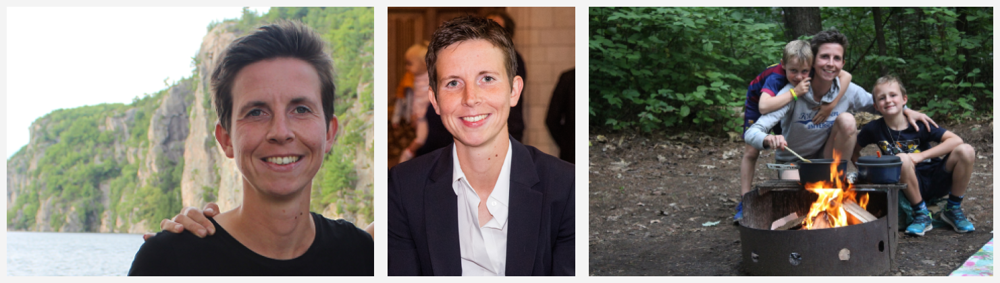
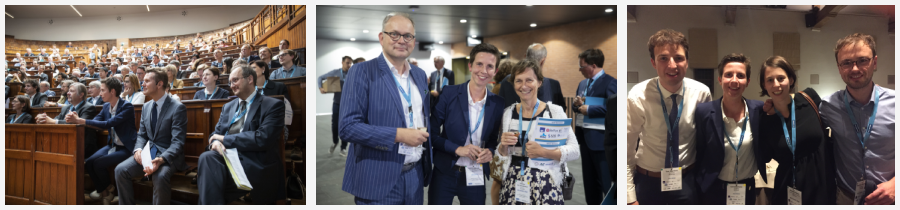

```{r, echo = FALSE, warning = FALSE, message = FALSE}
library(knitr)
library(magick)
"print.magick-image" <- function(x, ...){
  ext <- ifelse(length(x), tolower(image_info(x[1])$format), "gif")
  tmp <- tempfile(fileext = paste0(".", ext))
  image_write(x, path = tmp)
  knitr::include_graphics(tmp)
}
```

```{r setup, include=FALSE}
knitr::opts_chunk$set(echo = TRUE)
```

Mathematician by training I am interested in data analysis, statistics, machine learning and mathematical modelling with a particular focus on insurance problems. I combine a professor position at [KU Leuven](http://www.kuleuven.be) ([Research Centre Insurance](https://feb.kuleuven.be/research/accounting-finance-insurance/accounting-finance-insurance)) with a part-time position as associate professor at [University of Amsterdam](http://www.uva.nl) (with the [Amsterdam School of Economics](http://ase.uva.nl/), section of [Quantitative Economics](http://ase.uva.nl/content/sections/quantitative-economics/quantitative-economics.html?origin=vIKfcTWDRhm7LK3K5uNeRw)). I am co-director of [LRisk](http://www.lrisk.be), the Leuven Centre for Insurance and Financial Risk Analysis.

```{r,  echo = FALSE, message = FALSE, fig.align = "center", out.width = "100%"}
library(magick)
library(magrittr)

katrien1 <- image_read("images/katrien_cut.png") %>% 
  image_scale("400") %>% 
  image_scale("x400") %>% 
  image_border("#f4f4f4", "10x10")

katrien2 <- image_read("images/katrien_cut_trouw.png") %>% 
  image_scale("400") %>% 
  image_scale("x400") %>% 
  image_border("#f4f4f4", "10x10")

katrien3 <- image_read("images/katrien_kampvuur.jpg") %>% 
  image_scale("400") %>% 
  image_scale("x400") %>% 
  image_border("#f4f4f4", "10x10")

katrien_first <- c(katrien1, katrien2, katrien3)

all_katrien_first <- image_append(katrien_first)
image_write(all_katrien_first, path = "images/all_katrien_first.png",format = "png")


```

My [research projects](http://katrienantonio.github.io/projects) are **data driven**, and find direct inspiration in collaborations with insurance companies or pension funds. The challenges raised by these insurance problems naturally create **spill-over effects** to other fields (e.g. pricing service contracts offered by OEMs) and to more **methodogical** contributions (e.g. the SMuRF package).

I love **teaching** and have extensive [experience](http://katrienantonio.github.io/teaching) with teaching at all levels of higher education, coordinating courses for both small and large groups of students. More about [my courses](http://katrienantonio.github.io/teaching). Teaching abroad and creating in-company workshops related to my research agenda allow me to further expand my horizon. I serve as the program director of the [MSc of Actuarial and Financial Engineering](https://feb.kuleuven.be/eng/prospective-students/master-of-actuarial-and-financial-engineering) at KU Leuven.

With my former PhD student Roel Verbelen I run the [DataCamp](http://www.datacamp.com) course on [Valuation of Life Insurance Products in R](https://www.datacamp.com/courses/valuation-of-life-insurance-products-in-r). 

```{r,  echo = FALSE, message = FALSE, fig.align = "center", out.width = "100%"}
library(magick)
library(magrittr)

CEO1 <- image_read("images/CEO Event (86).jpg") %>% 
  image_scale("400") %>% 
  image_scale("x400") %>% 
  image_border("#f4f4f4", "10x10")

CEO2 <- image_read("images/CEO Event (132).jpg") %>% 
  image_scale("400") %>% 
  image_scale("x400") %>% 
  image_border("#f4f4f4", "10x10")

FC <- image_read("images/faculty club.jpg") %>% 
  image_scale("400") %>% 
  image_scale("x400") %>% 
  image_border("#f4f4f4", "10x10")

katrien <- c(CEO1, CEO2, FC)

all_katrien <- image_append(katrien)
image_write(all_katrien, path = "images/all_katrien.png",format = "png")


```


